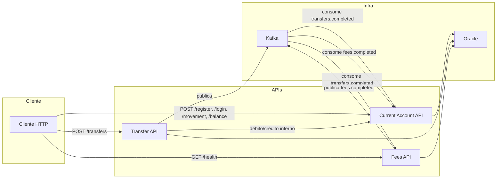
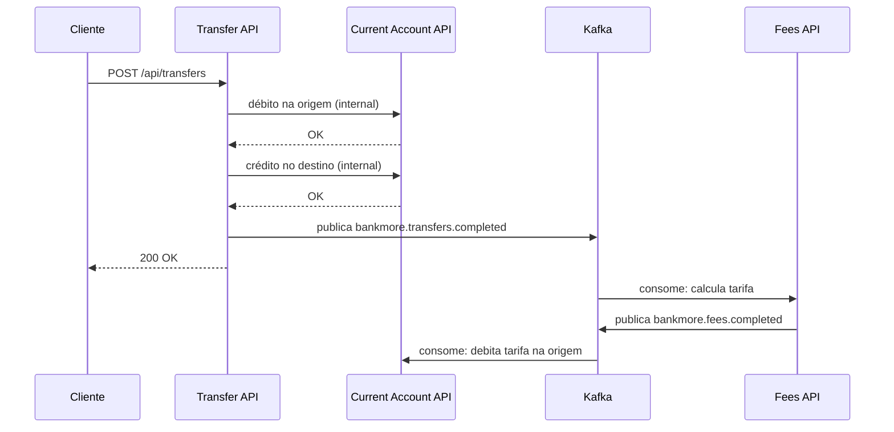
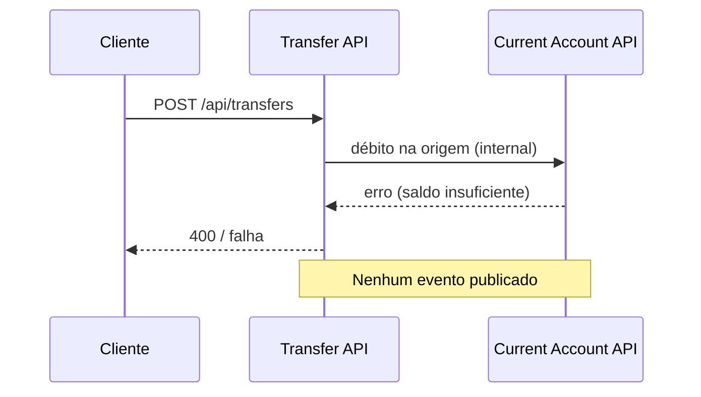
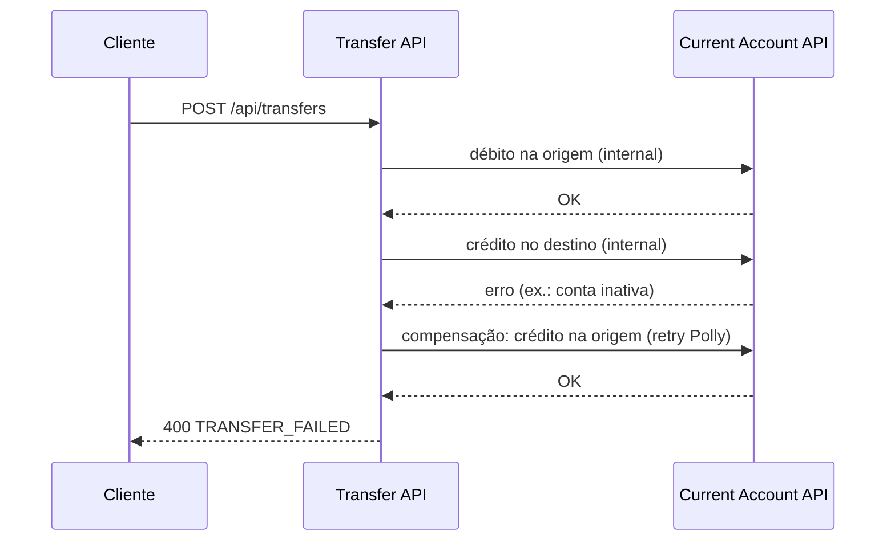

# BankMore – Plataforma de Contas Digitais

## 🔐 Credenciais de Banco de Dados (Oracle)

Para visualizar dados e tabelas em ferramentas como **DBeaver** ou **SQL Developer**:

| Campo       | Valor        |
|-------------|--------------|
| **Host**    | `localhost`  |
| **Porta**   | `1521`      |
| **Serviço** | `XEPDB1`    |
| **Usuário** | `bankmore`  |
| **Senha**   | `bankmore`  |

**Connection string (JDBC):** `jdbc:oracle:thin:@localhost:1521/XEPDB1`  
**Usuários admin (SYS/SYSTEM):** senha = `bankmore` (ORACLE_PASSWORD do compose)

### Schemas e Usuários

O usuário **bankmore** é o schema de aplicação (criado automaticamente pelo Docker com `APP_USER` / `APP_USER_PASSWORD`). Todas as tabelas são criadas nesse schema.

---

# 📌 Visão Geral

O **BankMore** é uma plataforma bancária distribuída baseada em microserviços para gestão de contas correntes, transferências e cobrança de tarifas.

A arquitetura utiliza:

- **Microserviços**
- **CQRS** (Command Query Responsibility Segregation)
- **Mensageria com Kafka**
- **Banco Oracle** com tabelas por serviço
- **Consistência eventual**
- **Saga** orientada a eventos
- **Idempotência**
- **Minimal APIs**

Toda a aplicação é **containerizada** e pode ser iniciada com um único comando na raiz do projeto. É necessário ter o **Docker em execução** no computador (ou em um ambiente já containerizado) para subir o ambiente.

---

# 🏗️ Arquitetura

Arquitetura de microserviços orientada a eventos:

| Componente            | Descrição                    |
|-----------------------|------------------------------|
| **Current Account**   | Cadastro, login, movimentação e saldo |
| **Transfer**          | Transferências entre contas  |
| **Fees**              | Cobrança de tarifas (consumer Kafka) |
| **Kafka**             | Integração assíncrona        |
| **Oracle**            | Persistência                 |

## Princípios adotados

- **CQRS** (Command Query Responsibility Segregation)
- **DDD leve**
- **Banco por serviço** (tabelas logicamente isoladas no mesmo schema)
- **Consistência eventual**
- **Saga** para transações distribuídas
- **Idempotência** em operações sensíveis
- **APIs minimalistas**
- **Baixo acoplamento**
- **Middleware de erros** – captura exceções não tratadas, devolve respostas padronizadas (HTTP status + mensagem) e registra logs com correlation id

---

# 🗄️ Bases de Dados

As tabelas são criadas no schema **bankmore** e organizadas por serviço.

## Tabelas – Current Account (contacorrente)

| Tabela             | Descrição                          |
|--------------------|------------------------------------|
| `contacorrente`    | Contas e dados cadastrais          |
| `movimento`        | Débitos e créditos                 |
| `idempotencia_kafka` | Idempotência de mensagens Kafka |

## Tabelas – Transfer (transferencia)

| Tabela         | Descrição                    |
|----------------|------------------------------|
| `transferencia`| Registro de transferências   |

## Tabelas – Fees (tarifas)

| Tabela   | Descrição               |
|----------|-------------------------|
| `tarifas`| Tarifas aplicadas       |

## Relacionamentos

- `movimento` → `contacorrente`
- `tarifas` → `contacorrente`
- `transferencia` → `contacorrente` (origem e destino)

---

# 🐳 Containerização

Ambiente 100% **Docker** + **Docker Compose**.

**Requisito:** é necessário ter o **Docker** em execução no computador (Docker Desktop no Windows/Mac ou daemon no Linux) ou estar em um ambiente já containerizado (ex.: servidor com Docker, CI/CD com Docker). Sem o Docker rodando, os comandos `docker compose build` e `docker compose up` falham.

## Subir tudo

Na raiz do projeto: use o botão de build do Docker no IDE, o script **build.ps1** ou execute manualmente:

```powershell
.\build.ps1
# ou, para ver os logs em primeiro plano:
.\build.ps1 -Attach
```

Alternativa manual:

```bash
docker compose build
docker compose up -d
```

O script `build.ps1` faz pre-pull das imagens .NET (com retry) antes do `docker compose up`, útil em redes instáveis.

## O que sobe automaticamente

| Componente          | Descrição                          |
|---------------------|------------------------------------|
| **Oracle**          | Banco de dados (porta 1521)        |
| **Kafka**           | Broker de mensagens (porta 9092)   |
| **Schemas**         | Usuário `bankmore` criado          |
| **Tabelas**         | Criação via init container         |
| **Índices**         | Definições nos scripts DDL         |
| **Volumes**         | `oracle-data` e `kafka-data`       |
| **Tópicos Kafka**   | `bankmore.transfers.completed`, `bankmore.fees.completed`, `bankmore.current-account.dlq` |
| **Microserviços**   | Current Account, Transfer, Fees    |
| **Init Containers** | `oracle-db-init`, `kafka-init`     |

### Init Containers

| Init             | Função                                        |
|------------------|-----------------------------------------------|
| **oracle-db-init** | Cria tabelas, constraints, índices no Oracle |
| **kafka-init**     | Cria tópicos e configura partições           |

Nenhuma ação manual é necessária para criação de schema ou tópicos.

---

# 📬 Mensageria (Kafka)

A comunicação entre serviços ocorre via eventos no **Kafka**.

## Tópicos

| Tópico                       | Producer     | Consumers               | Conteúdo                          |
|-----------------------------|--------------|--------------------------|-----------------------------------|
| `bankmore.transfers.completed` | Transfer   | Fees, Current Account    | transferId, contas, valor, data    |
| `bankmore.fees.completed`   | Fees          | Current Account          | feeId, transferId, conta, valor   |
| `bankmore.current-account.dlq` | Current Account | (DLQ)               | Mensagens com erro               |

## Benefícios

- Desacoplamento entre serviços
- Consistência eventual
- Retry seguro
- Escalabilidade
- Orquestração de saga

---

# ♻️ Idempotência

Operações financeiras usam chave idempotente persistida em banco. Mensagens Kafka são processadas com controle de duplicidade via `idempotencia_kafka`.

## Garantias

- Requisições duplicadas não executam duas vezes
- Segurança em retry HTTP
- Segurança em retry Kafka
- Consumo idempotente de eventos

---

# 🔄 Saga

Transferências envolvem múltiplos serviços. O sistema usa **Saga orientada a eventos**.

## Etapas

1. Transferência iniciada
2. Débito na conta origem (via API interna Current Account)
3. Crédito na conta destino (via API interna Current Account)
4. Publicação de evento `bankmore.transfers.completed`
5. Fees consome → calcula tarifa → publica `bankmore.fees.completed`
6. Current Account consome → debita tarifa na conta de origem

## Benefícios

- Sem transação distribuída (XA)
- Consistência eventual
- Recuperação automática
- Alta resiliência

---

# ⚙️ Minimal APIs

Os serviços HTTP utilizam **Minimal APIs** do ASP.NET Core.

## Características

- Endpoints enxutos
- Sem controllers pesados
- Alta performance
- Baixa verbosidade
- Foco no domínio

## Endpoints (resumo)

**Current Account** (porta 5000, base `/api/accounts`; autenticação JWT exceto register e login)

| Método | Endpoint | Descrição |
|--------|----------|-----------|
| POST | `/api/accounts/register` | Cadastrar conta (CPF, senha). **Não exige auth**: no primeiro momento ainda não existe conta nem token; o register é a porta de entrada para criar contas (e popular a base para testes). |
| POST | `/api/accounts/login` | Login (número/CPF, senha); retorna token. **Não exige auth**: é por aqui que se obtém o token; sem login prévio não há como enviar Bearer. |
| GET | `/api/accounts/balance` | Saldo da conta do token |
| POST | `/api/accounts/movement` | Débito/crédito na conta do token |
| POST | `/api/accounts/inactivate` | Inativar conta do token (senha no body) |

**Current Account – internos** (header `X-Internal-Api-Key`; uso pelo Transfer)

| Método | Endpoint | Descrição |
|--------|----------|-----------|
| GET | `/api/internal/account-id?number=` | Retorna GUID da conta pelo número |
| POST | `/api/internal/movement` | Movimentação por accountId (débito/crédito) |

**Transfer** (porta 5001; JWT)

| Método | Endpoint | Descrição |
|--------|----------|-----------|
| POST | `/api/transfers/` | Transferir (body: `destinationAccountNumber`, `amount`; origem = conta do token) |

**Fees** (porta 5002)

| Método | Endpoint | Descrição |
|--------|----------|-----------|
| GET | `/health` | Health check |

---

# ⚙️ Configurações

Cada microserviço usa **appsettings.json** e **Options Pattern** para configuração. Variáveis de ambiente sobrescrevem valores (ex.: no Docker ou Kubernetes).

## Current Account

| Seção / Chave | Descrição |
|---------------|-----------|
| `ConnectionStrings__DefaultConnection` | Oracle |
| `Jwt__Secret`, `Jwt__Issuer`, `Jwt__Audience` | Autenticação |
| `Internal__ApiKey` | Chave para endpoints internos (Transfer) |
| `Kafka__BootstrapServers`, `Kafka__TopicTransfersCompleted`, `Kafka__TopicFeesCompleted`, `Kafka__TopicDlq` | Mensageria |

## Transfer

| Seção / Chave | Descrição |
|---------------|-----------|
| `ConnectionStrings__DefaultConnection` | Oracle |
| `CurrentAccountApi__BaseUrl`, `CurrentAccountApi__InternalApiKey` | API interna de contas |
| `Jwt__Secret` | Validação do token (mesmo da Current Account) |
| `Kafka__BootstrapServers`, `Kafka__TopicTransfersCompleted` | Mensageria |

## Fees

| Seção / Chave | Descrição |
|---------------|-----------|
| `Kafka__BootstrapServers`, `Kafka__TopicTransfersCompleted`, `Kafka__TopicFeesCompleted`, `Kafka__ConsumerGroupId` | Mensageria |
| `Fee__FixedAmountPerTransfer` | Valor fixo da tarifa por transferência (ex.: 1.00) |

## Domain Configurations

Constantes estáticas em código (tamanhos, limites): `CurrentAccountConfiguration`, `MovementConfiguration`, `TransferConfiguration`.

---

# 🧪 Testes

## Testes unitários

- Regras de domínio
- Validações
- Casos de negócio

## Testes de integração

- Oracle em container
- Kafka real
- Fluxos completos

## Execução

```bash
cd bank-more-current-account && dotnet test
cd bank-more-transfer && dotnet test
cd bank-more-fees && dotnet test
```

---

# ▶️ Fluxos do Sistema

## Desenho do fluxo da aplicação

O diagrama abaixo mostra como os componentes se comunicam (fluxo feliz e mensageria).



### Fluxo feliz (transferência) – sequência



### Fluxo de erro (saldo insuficiente)



### Fluxo de erro (crédito falha – Saga/compensação)

Quando o débito na origem é feito mas o crédito no destino falha (ex.: conta inativa), a Saga aplica compensação (estorno na origem) com retry (Polly).



---

# 🔑 Token e identificação do usuário

Em **todas as requisições autenticadas**, o **token JWT** (obtido no login) identifica **quem** está fazendo a operação. O corpo da requisição não precisa repetir a conta de origem ou o titular.

- **Inativação** – A pessoa envia só a **senha** no body. **Quem** está sendo inativado é a conta do token: o header `Authorization: Bearer <token>` já identifica a conta; a senha só confirma que é o titular.
- **Transferência** – Não é necessário informar **de onde** sai o dinheiro. Basta enviar **destino** (número da conta) e **valor**. A conta de origem é a do token: quem está logado é quem está transferindo.
- **Saldo e movimentação** – Saldo e movimentações (débito/crédito) referem-se sempre à conta do token.

Ou seja: o token resolve a identidade em todas as chamadas; o body traz só o que complementa (senha, valor, conta destino etc.).

---

# 📮 Testes via Postman

O projeto inclui a collection **BankMore-API-Tests.postman_collection.json**.

## Caminho Feliz

1. **Register (1ª conta)** – `POST /api/accounts/register`
2. **Login** – `POST /api/accounts/login` (obter token; a collection salva em `token`)
3. **Register (2ª conta)** – criar conta destino
4. **Movement (crédito R$ 100)** – `POST /api/accounts/movement` com `type: "C"`
5. **Transfer** – `POST /api/transfers` (conta 1 → conta 2, ex.: R$ 15)
6. **Balance** – conferir débito (15 + 1 de tarifa = R$ 16)

## Cenários de Falha (caminho de erro)

Use a pasta **Transfer (5001) → Cenários de Erro (Saga/Polly)** na collection.

| Cenário | Passos | Resultado esperado |
|--------|--------|--------------------|
| **Saldo insuficiente** | Login conta 1 (sem dar crédito antes). Transfer com valor maior que o saldo (ex.: R$ 999). | 400; nenhum débito; nenhum evento Kafka. |
| **Conta destino inativa (Saga/Polly)** | 1) Register 3ª conta → 2) Login conta 3 → 3) Inactivate conta 3 → 4) Login conta 1 → 5) Transfer para conta 3. | 400 `TRANSFER_FAILED`; débito na origem é compensado (estorno) com retry; conferir logs do Transfer. |
| **Destino inválido** | Transfer com `destinationAccountNumber: 99999`. | 400; conta não existe; falha antes do débito. |
| **Mesma conta** | Login conta 1. Transfer com `destinationAccountNumber: 1`. | 400; origem = destino; falha antes do débito. |
| **Valor inválido** | Transfer com `amount: 0`. | 400; validação de valor. |

Ordem sugerida para testar falha: executar os itens da pasta na sequência (1 a 5 para Saga/Polly; depois “Erro - Destino inválido”, “Erro - Mesma conta”, “Erro - Valor inválido”).

## Dados de exemplo

| Uso        | Campo       | Valor       |
|------------|-------------|-------------|
| 1ª conta   | CPF         | 52998224725 |
| 1ª conta   | Senha       | SenhaSegura123 |
| 2ª conta   | CPF         | 11144477735 |
| 2ª conta   | Senha       | OutraSenha123 |
| Tarifa fixa| Config      | 1.00 (`Fee__FixedAmountPerTransfer`) |

## Variáveis da collection

| Variável   | Valor padrão |
|------------|--------------|
| baseCurrentAccount | http://localhost:5000 |
| baseTransfer       | http://localhost:5001 |
| baseFees           | http://localhost:5002 |
| token              | (preenchido pelo Login) |

---

# ▶️ Execução Rápida

```bash
docker compose build
docker compose up -d
```

Tudo será criado automaticamente:

- Banco
- Tabelas
- Kafka e tópicos
- Serviços
- Volumes persistentes

## Portas

| Serviço         | Porta | URL                 |
|-----------------|-------|---------------------|
| Current Account | 5000  | http://localhost:5000 |
| Transfer        | 5001  | http://localhost:5001 |
| Fees            | 5002  | http://localhost:5002 |
| Oracle          | 1521  | -                   |
| Kafka           | 9092  | -                   |

---

# 📚 Tecnologias

- **.NET 8**
- **Minimal APIs**
- **Oracle Database** (gvenzl/oracle-xe)
- **Docker** / **Docker Compose**
- **Apache Kafka** (KRaft mode)
- **Saga Pattern**
- **Idempotência**
- **REST**
- **JWT**
- **Serilog**

---

# 🚀 Deploy em Kubernetes

Os manifestos de produção estão em `k8s/`. Consulte `k8s/README.md` para a ordem de aplicação e pré-requisitos.

```bash
kubectl apply -f k8s/
```

---

# 👨‍💻 Observações

- Ambiente local completo
- Sem configuração manual de banco ou Kafka
- Pronto para cloud
- Arquitetura resiliente
- Escalável horizontalmente

---

*Desenvolvido por Bruno Tomm*
